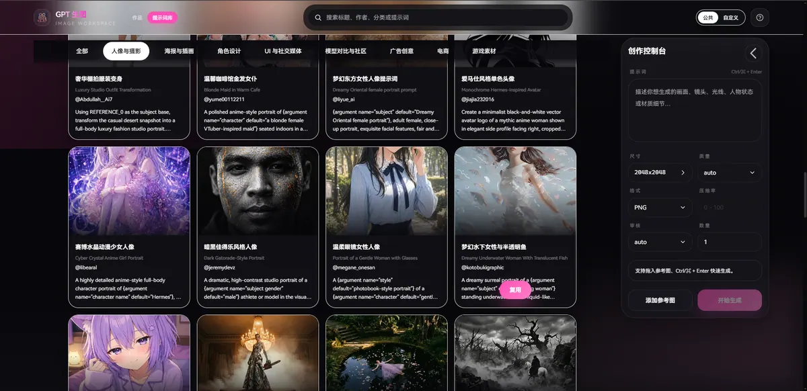
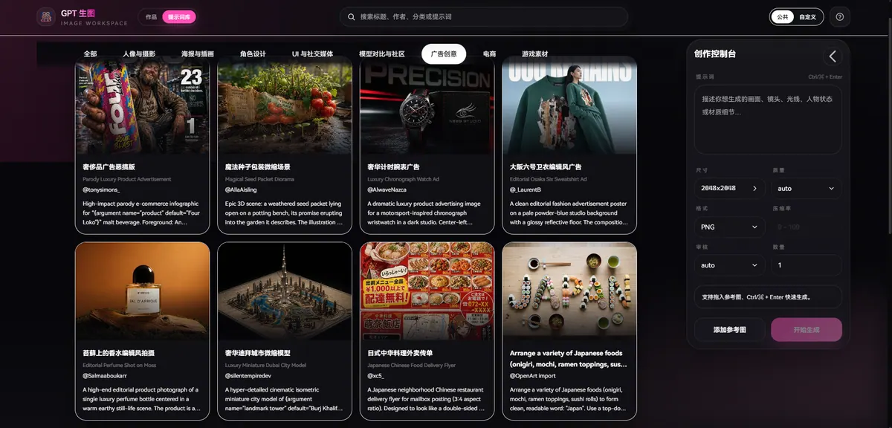
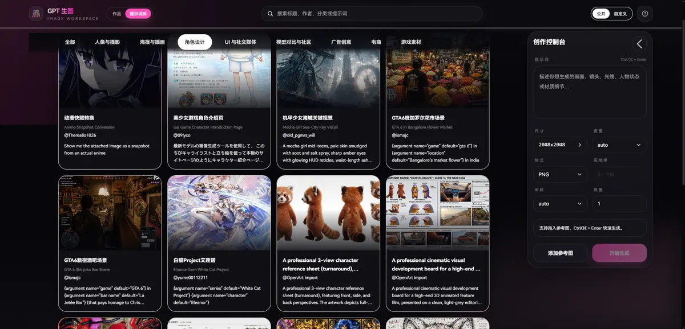
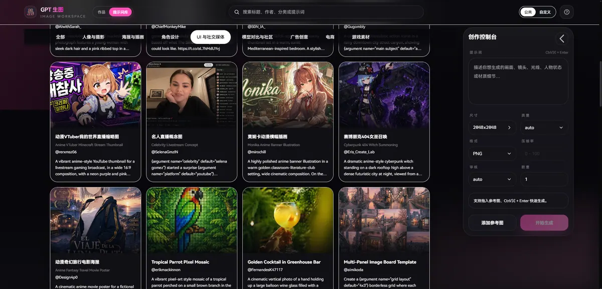
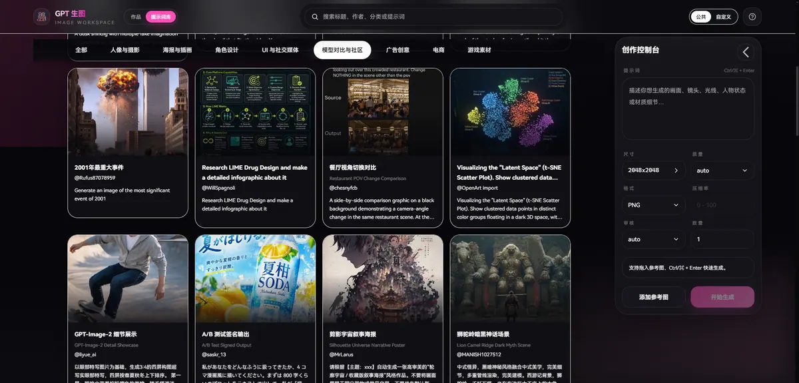
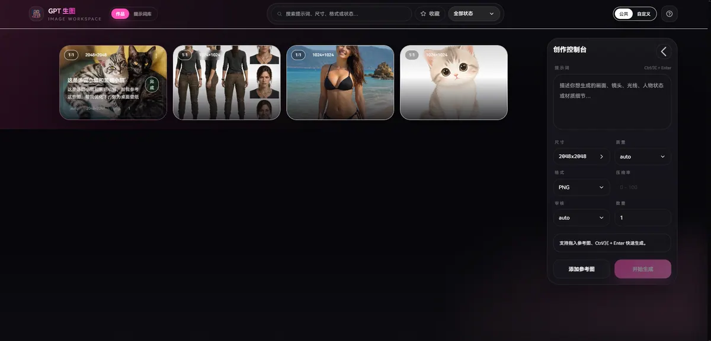
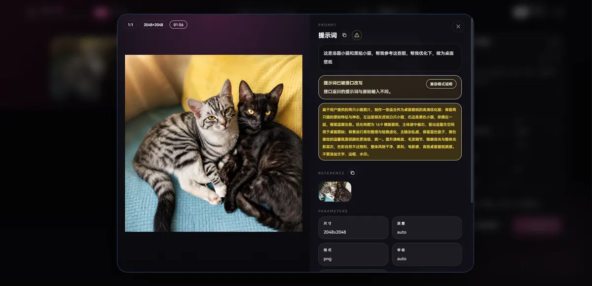

# Goodness Images

基于 OpenAI 图像生成接口的图片生成与编辑工具。提供简洁的 Web UI，支持文本生成图片、参考图编辑、可视化参数调节、历史记录管理与本地数据导入导出。

---

## 📸 功能截图

### 公共提示词库

公共提示词库内置多分类图片生成案例，支持分类切换、关键词搜索、瀑布流浏览、详情查看、中英提示词展示与一键复用，适合快速参考不同场景的提示词写法。

<div align="center">
  <b>多类型提示词案例</b><br>
  
</div>

<br>

<div align="center">
  <b>多图浏览与分类筛选</b><br>
  
</div>

<br>

<div align="center">
  <b>详情页支持中英提示词与一键复用</b><br>
  
</div>

<br>

| 人物摄影 | 海报与插画 |
| --- | --- |
|  |  |
| 广告 | 电商 |
|  |  |
| 游戏素材 | 角色设计 |
|  |  |
| UI 与社交媒体 | 模型对比与社区 |
|  |  |

### 自定义生成图库

自定义生成图库用于管理浏览器本地生成历史，支持 IndexedDB 图片缓存、详情查看、参数追踪、复用生成配置、收藏筛选以及导入导出，适合沉淀自己的提示词和生成结果。

| 本地缓存与图库管理 | 详情信息与参数回溯 |
| --- | --- |
|  |  |

---

## ✨ 功能特性

### 🎨 核心能力
- **文本生图**：输入提示词，可调用 `images/generations` 或 Responses API 的 `image_generation` 工具生成图片。
- **参考图编辑**：支持上传最多 16 张参考图，可调用 `images/edits` 或 Responses API 多模态输入进行图片编辑。支持文件选择、粘贴和拖拽三种方式。
- **接口模式切换**：支持在设置中选择 Images API (`/v1/images`) 或 Responses API (`/v1/responses`)。
- **公共 / 自定义模式切换**：支持在右上角一键切换“公共模式”和“自定义模式”。公共模式使用应用内置配置，自定义模式使用设置弹窗中保存的个人配置。
- **公共提示词库**：内置多分类提示词案例，支持中英提示词、分类切换、关键词搜索、详情查看和一键复用。
- **批量生成**：单次可设置生成多张图片。
- **Codex CLI 兼容模式**：可在设置中开启 Codex CLI 模式。开启后根据 Codex CLI 中的实际可用能力，将质量参数固定为 `auto` 且不会发送 `quality` 字段；Images API 的多图生成会拆分为多个并发请求完成，解决该 API 数量参数无效的问题；提示词文本开头会加入简短的不改写要求，避免模型重写提示词，偏离原意。

### ⚙️ 精细化参数控制
- **智能尺寸选择器**：支持 `auto`、按 `1K / 2K / 4K` 结合常用比例自动计算分辨率，同时也支持手动输入自定义宽高。
- **自动规整**：为了兼容模型限制，自定义尺寸会自动规整到合法范围：宽高均为 16 的倍数，最大边长 `3840px`，宽高比不超过 `3:1`，总像素限制为 `655360` 到 `8294400`。
- **预设反推**：打开尺寸选择弹窗时，会自动根据当前尺寸匹配对应的预设比例。
- **其他选项**：支持调整质量 (`low`, `medium`, `high`)、输出格式 (`PNG`, `JPEG`, `WebP`)、压缩率 (0-100) 以及审核强度。
- **实际参数追踪**：会记录 API 返回的实际尺寸、质量、格式、数量与改写提示词，并在与请求值不一致时高亮展示。

### 📁 历史记录与工作流
- **瀑布流任务卡片**：直观展示生成缩略图、提示词、参数和耗时。支持按状态筛选与关键词搜索。
- **收藏与筛选**：支持收藏常用记录，并可一键只看收藏内容。
- **多选批量操作**：桌面端支持拖拽框选和 Ctrl/⌘ 点击多选，移动端支持左右侧滑选择；选中后可批量收藏、删除或全选当前可见记录。
- **快速复用**：一键将历史记录的配置与提示词回填到输入框。
- **迭代生成**：支持将生成的输出结果直接添加到参考图列表中，进行下一轮迭代编辑。
- **画廊与详情**：点击任务卡片可查看完整输入输出，支持大图浏览。
- **快捷操作**：支持图片右键或移动端长按唤出自定义菜单，快速复制或下载图片。

### 📱 体验优化
- **响应式布局**：桌面端提供更高效的批量选择与底部输入栏，移动端输入栏可折叠，并针对侧滑、多选和弹窗交互做了适配。
- **PWA 支持**：支持渐进式 Web 应用（PWA），可将网页作为独立应用安装到桌面或移动设备主屏幕，提供类似原生 App 的沉浸式体验。

### 💾 本地数据优先
- **IndexedDB 存储**：所有任务记录与图片数据均存储在浏览器的 IndexedDB 中，数据绝不离开本地。
- **性能优化**：参考图采用内存缓存与延迟存储机制，图片采用 SHA-256 哈希自动去重，并在每次启动时自动清理孤立的图片碎片。
- **导入与导出**：支持将完整数据打包为 ZIP 导出。导出的 ZIP 内包含原始图片文件（非 base64）和记录图片元数据的 `manifest.json`，方便备份与迁移。

---

## 🚀 本地运行

安装依赖并启动开发服务器：

```bash
npm install
npm run dev
```

随后浏览器访问 `http://localhost:5173`。

如需预置默认 API 地址，可在项目根目录新建 `.env.local`：

```bash
VITE_DEFAULT_API_URL=https://api.openai.com/v1
```

构建静态产物：

```bash
npm run build
```

---

## 🛠️ API 配置说明

点击页面右上角的设置图标，你可以随时更改 API 相关的配置。

- **公共模式**：使用 `src/lib/settings.ts` 中定义的系统内置配置，也支持通过 `VITE_SYSTEM_*` 环境变量覆盖，适合多人共用。
- **自定义模式**：使用右上角设置中保存的个人配置，适合按人区分不同 API 节点、Key 或模型。
- 公共模式下，设置弹窗仍然会保存你的自定义配置，但只有切回自定义模式后才会真正生效。
- 如果你准备把 API Key 内置到前端公共模式，请注意它会暴露给浏览器端用户；生产环境更安全的方案仍然是使用服务端代理。

- **Images API**：调用 `/v1/images/generations` 和 `/v1/images/edits`，模型需要填写 GPT Image 模型，例如 `gpt-image-2`。
- **Responses API**：调用 `/v1/responses` 并使用 `image_generation` 工具，模型需要填写支持该工具的文本模型，例如 `gpt-5.5`。
- **Codex CLI 模式**：如果你在使用源于 Codex CLI 的 API，可以在 `API URL` 右侧开启该模式。开启后应用不会向任何接口发送 `quality` 参数，界面中的质量选项也会固定为 `auto`；同时会在提示词文本开头加入简短的不改写要求，避免模型重写提示词，偏离原意。
- Codex CLI 模式下，Images API 的图片数量会通过并发发起多个单图请求实现；Responses API 原本也通过并发请求实现多图生成。
- 如果检测到接口返回的提示词被改写，应用会提示是否为当前 `API URL + API Key` 组合开启 Codex CLI 模式；取消后，同一组合不再重复询问。

应用支持通过 URL 查询参数快速填充配置，非常适合书签或分享给他人使用：
- `?apiUrl=https://你的代理地址.com`
- `?apiKey=sk-xxxx`
- `?apiMode=images` 或 `?apiMode=responses`，未传时默认使用 `images`
- `?codexCli=true` 或 `?codexCli=false`，未传时默认关闭，仅 `true` 会开启 Codex CLI 模式

---

## 🧰 提示词库维护脚本

公共提示词库的整理、导入、缩略图生成和翻译辅助脚本统一放在 `scripts/prompt-gallery/`，运行时前端不会依赖这些脚本。目录内的 [README](scripts/prompt-gallery/README.md) 记录了每个脚本的用途和本地数据约定。

常用命令：

```bash
npm run build:prompt-gallery
npm run build:prompt-gallery:thumbs
npm run import:game-assets
npm run translate:prompt-gallery
npm run apply:openart-translations
```

`docs/outputs/` 是本地抓取、分类和导入流程的中间产物目录，可能包含原始图片、原始 JSON、远程 CDN URL、本机路径和处理缓存。该目录已在 `.gitignore` 中忽略，不建议提交到开源仓库；公共站点实际读取的是 `public/prompt-gallery/` 下的索引、图片和缩略图。

## 💻 技术栈

- **框架**：[React 19](https://react.dev/) + [TypeScript](https://www.typescriptlang.org/)
- **构建工具**：[Vite](https://vite.dev/)
- **样式**：[Tailwind CSS 3](https://tailwindcss.com/)
- **状态管理**：[Zustand](https://zustand.docs.pmnd.rs/)
- **数据存储**：浏览器的 IndexedDB API

## 📄 许可证

[MIT License](LICENSE)

## 🔗 致谢

[LINUX DO](https://linux.do)
